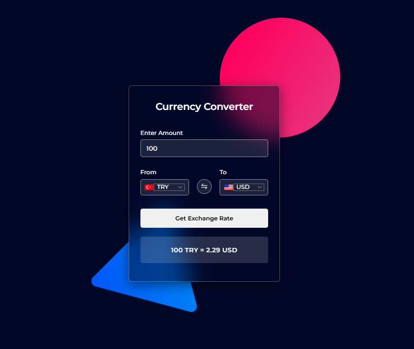

## 💱 Application Preview

# Currency Converter ReactJS Kurulum Rehberi

Currency Converter projenizi herhangi bir hata almadan çalıştırmak için aşağıdaki adımları takip ediniz:

## API Anahtarınızı Alın

1. [ExchangeRate-API](https://www.exchangerate-api.com/). adresine giderek bir hesap oluşturun.
2. API key bölümüne gidin ve yeni bir API anahtarı oluşturun.

**Not:** API ücretsizdir ancak günlük istek (request) limiti bulunmaktadır.

## API Anahtarınızı Ekleyin

1. Proje klasörünüzü VS Code ile açın.
2. Projenizde bulunan `components/ConverterForm.jsx` dosyasını bulun.
3. Dosya içerisinde yer alan `API_KEY` değişkenini bulun ve `YOUR-API-KEY` yazan kısmı kendi API anahtarınız ile değiştirin.

## Kaydedin ve Test Edin

1. API anahtarını ekledikten sonra `components/ConverterForm.jsx` dosyasını kaydedin.
2. VS Code terminalini `Ctrl + J` tuşlarına basarak açın ve aşağıdaki komutları çalıştırın:

   `npm install` → Gerekli bağımlılıkları yükler.  
   `npm run dev` → Yerel geliştirme sunucusunu başlatır.

Terminalde çıkan `localhost` bağlantısına tıklayarak projeyi tarayıcınızda açabilir ve çalışıp çalışmadığını kontrol edebilirsiniz.

---

# Currency Converter ReactJS Setup Guide

Please follow these steps to run your Currency Converter project without any errors:

## Get Your API Key

1. Sign up for an account at [ExchangeRate-API](https://www.exchangerate-api.com/).
2. Navigate to the API key section and generate a new API key.

**Note:** The API is free but has a limited number of requests per day.

## Insert Your API Key

1. Open your project folder in VS Code.
2. Locate the `components/ConverterForm.jsx` file in your project.
3. Find the `API_KEY` variable and replace `YOUR-API-KEY` with your actual API key.

## Save and Test

1. Save the `components/ConverterForm.jsx` file after adding your API key.
2. Open the VS Code terminal by pressing `Ctrl + J` and run the following commands:
   `npm install` This command will install the necessary dependencies.
   `npm run dev` This command will start the local development server.

Click on the `localhost` link that appears in the terminal to open the project in your browser and check its functionality.
